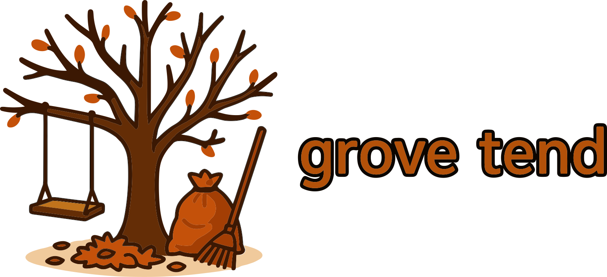

<!-- DOCGEN:OVERVIEW:START -->



Grove Tend is a Go library for creating scenario-based end-to-end testing frameworks. It is designed with a library-first philosophy, allowing developers to build a custom test runner binary tailored to their project's needs. This approach replaces ad-hoc shell scripts with structured, maintainable, and debuggable Go code, keeping test definitions and logic directly within the project's codebase.

<!-- placeholder for animated gif -->

## Key Features

-   **Scenario-Based Testing**: Organizes tests into logical `Scenario`s composed of sequential `Step`s that share a common `Context`, making complex test flows easy to read and manage.
-   **Helper Packages**: Provides a set of built-in helpers for common testing operations, including filesystem interactions (`fs`), Git repository management (`git`), command execution (`command`), and assertions (`assert`).
-   **First-Class Mocking**: Supports defining mocks as Go binaries, which can be compiled and managed by the test harness. This allows for seamless swapping between mocked and real dependencies for different stages of testing.
-   **Advanced TUI Testing**: Offers a "Playwright for the Terminal" experience by enabling the testing of interactive Terminal User Interfaces (TUIs). It automates `tmux` sessions to launch, interact with, and assert on the state of TUI applications.
-   **Interactive Debugging**: Includes interactive (`-i`) and debug (`-d`) modes to facilitate troubleshooting. These modes allow developers to step through test execution, inspect state, and manually interact with TUI sessions.

## Ideal For

-   **CLI Tool Testing**: Validating commands with file I/O, environment variables, and exit codes.
-   **Integration Testing**: Orchestrating and testing tools that depend on other CLI programs like `git`, `docker`, or `kubectl`.
-   **TUI Applications**: Automating tests for interactive terminal UIs with complex navigation.
-   **Workflow Validation**: Verifying multi-step processes that require state to be maintained across actions.
-   **LLM-Generated Test Suites**: The framework's structure is optimized for AI generation and maintenance, enabling the creation of comprehensive test suites.

## How It Works

The core of Grove Tend is a test `Harness` that executes scenarios. The typical workflow is as follows:

1.  **Test Runner Creation**: A developer creates a main entry point for their tests (e.g., `tests/e2e/main.go`). This program imports the `grove-tend` library.
2.  **Scenario Definition**: Test cases are defined as `harness.Scenario` structs. Each scenario consists of one or more `harness.Step`s.
3.  **Step Execution**: The harness runs each step sequentially. Each step function receives a `harness.Context` object, which manages a temporary directory for the test run and provides a key-value store for passing state between steps.
4.  **Command Execution**: The `Context` provides a mock-aware `Command()` factory. When mocks are enabled, this factory ensures that calls to external tools (like `git` or `docker`) are routed to the mock binaries.
5.  **Cleanup**: After a scenario completes, the harness automatically cleans up all temporary resources, such as directories and `tmux` sessions, unless explicitly disabled for debugging.
6.  **CLI Interface**: The test runner, when compiled, becomes a command-line application that can list, run, and validate scenarios, offering filtering by name or tags.

## Role in the Grove Ecosystem

Grove Tend serves as the standard for end-to-end testing across all command-line tools within the Grove ecosystem. By providing a consistent framework, it ensures that all projects adhere to the same testing patterns, making it easier to write, understand, and maintain tests for any tool in the ecosystem. This standardization is critical for validating complex cross-tool interactions and maintaining a high level of quality and reliability. It helps agents build their own tools with reduced input from the developer, and serves as reference implementations.

## LLM-First Design Philosophy

While Grove Tend tests can be written by hand, their structure is intentionally designed to be generated and maintained by Large Language Models (LLMs). The tests may appear verbose compared to traditional unit tests, but this explicitness makes them easy for an LLM to comprehend, modify, and extend. This design choice enables the creation of comprehensive E2E test suites that cover complex user workflows, which would often be impractical to write and maintain manually. The tests serve as living, machine-readable documentation of the system's expected behavior.

## Interactive Debugging

The framework includes features designed to simplify the debugging of complex E2E test failures.

-   The interactive (`-i`) flag pauses execution before each step, prompting the user to continue, skip, or quit. For TUI tests, it adds an option to attach to the live `tmux` session for manual interaction.
-   The debug (`-d`) flag is a shorthand for a complete debugging environment. It enables interactive mode, disables cleanup of temporary files, and automatically splits the current `tmux` window, opening a new pane in the test's temporary directory. This allows developers to watch the test run on one side while inspecting files and logs on the other.

---

### Installation

Grove-tend is a Go library. Add it to your project:
```bash
go get github.com/mattsolo1/grove-tend
```

For CLI usage, install via Grove meta-CLI:
```bash
grove install tend
```

Verify CLI installation:
```bash
tend version
```

See the [Grove Installation Guide](https://github.com/mattsolo1/grove-meta/blob/main/docs/02-installation.md) for setup.

<!-- DOCGEN:OVERVIEW:END -->


<!-- DOCGEN:TOC:START -->

See the [documentation](docs/) for detailed usage instructions:
- [Overview](docs/01-overview.md) - 
- [Examples](docs/02-examples.md) - This example demonstrates how to test a standard command-line tool that inter...
- [Conventions](docs/03-conventions.md) - This document outlines the standard conventions for setting up, running, and ...

<!-- DOCGEN:TOC:END -->
